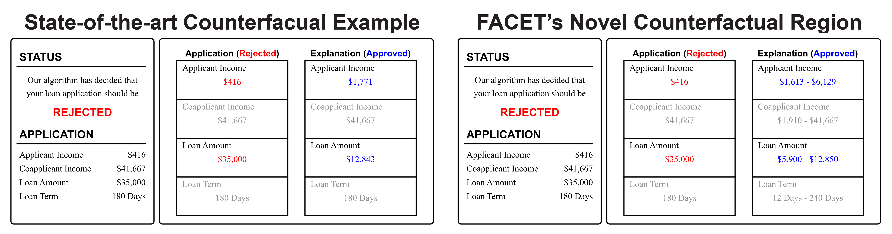
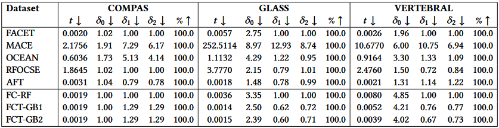
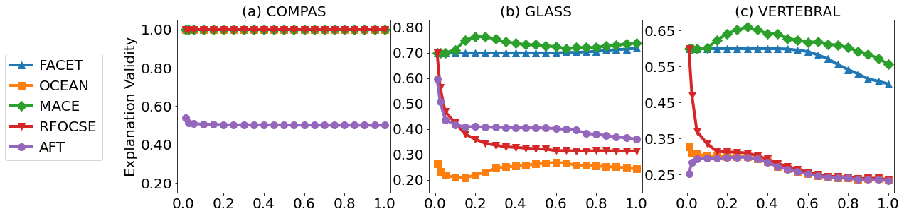
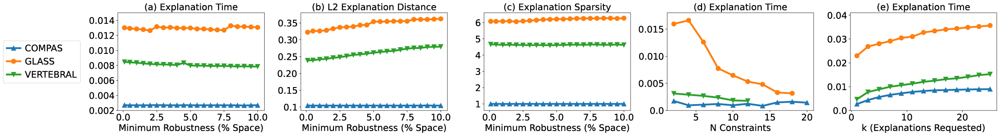
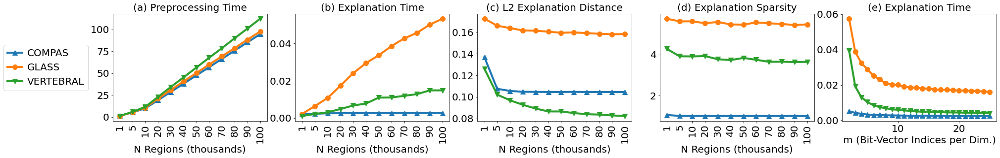
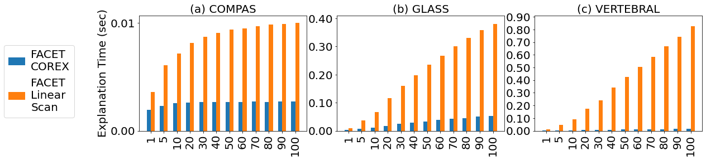
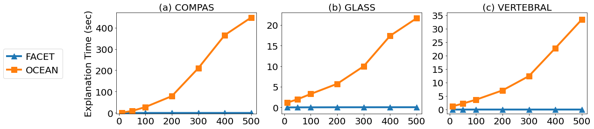
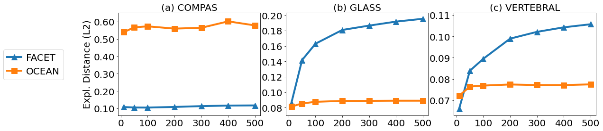

# FACET: Robust Counterfactual Explanation Analytics

This repository contains results, figures, sample images, and prototype code for the paper *FACET: Robust Counterfactual Explanation Analytics*, currently under review at SIGMOD 2024.

FACET (Fast Actionable Counterfactuals for Ensembles of Trees) generates a novel type of explanation which we call *counterfactual regions* for decisions made by ensembles of trees. For an instance `x` a counterfactual region `R` defines a portions of the feature space where all points `x' in R` are guaranteed to be counterfactual to `x`, e.g. if `y=f(x)=A` then `y=f(x')=B`. We design FACET to be highly performant and support a wide variety of user parameters such that explanations can be interactively personalized to meet real users needs.

## User Interface Sample Images

Sample images of the explanation visual interface used in our pilot user study can be seen below. The left is the interface for the state-of-the-art Counterfactual Example Explanations and right the interface for our novel Counterfactual Region Explanations.



## Results on Additional Datasets

Our paper includes results for FACET on five publicly available benchmark datasets. We include results for three additional datasets here: COMPAS, GLASS, and VERTEBRAL. For a listing of each dataset. For a listing of information on all datasets see [Datasets](#datasets).

### Table 3 - Comparing Methods

Comparison to state-of-the art counterfactual example generation techniques (upper, 𝑇 = 10, 𝐷𝑚𝑎𝑥 = 100) and FACET
variations on Gradient Boosting (lower 𝑇 = 100, 𝐷𝑚𝑎𝑥 = 3) in terms time 𝑡, sparsity 𝑠, L1-Norm 𝛿1, L2-Norm 𝛿2, validity %.



### Figure 9 - Robustness to Perturbation

Evaluation of nearest explanation robustness to varying random perturbation size (percent of space)



### Figure 10 - User Query Workloads

Evaluation of FACET’s explanation analytics with diverse query workloads



### Figure 11 - FACET's COREX Index Evaluation

Evaluation of FACET’s explanation analytics using COREX, our counterfactual region explanation index



### Figure 12 - FACET's COREX Index Response Time

Evaluation of query response time with and without COREX, FACET’s bit-vector based counterfactual region
explanation index. Varying 𝑁𝑟 , the number of indexed counterfactual regions.



### Figure 13 - Model Scalability - Explanation Time

Explanation time as a function of model complexity. Varying number of trees 𝑇.



### Figure 14 - Model Scalability - Explanation Distance

 Explanation distance as a function of model complexity. Varying number of trees 𝑇.



## Datasets

A listing of datasets which FACET has been applied on including the number of instance `N`, the number of features `n` and the number of features after one hot encoding. Datasets marked with `*` have results included in the paper with the remainder expect `loans` presented here. All figures shown here and in the paper can be found in the `./figures/` directory.

| Dataset Name                                   | Abbreviated Name | N     | n   | n (one-hot) | Source                                                                                  |
| ---------------------------------------------- | ---------------- | ----- | --- | ----------- | --------------------------------------------------------------------------------------- |
| Adult*                                         | `adult`          | 45222 | 11  | 41          | [OCEAN](https://github.com/vidalt/OCEAN)                                                |
| Breast Cancer Wisconsin (Diagnostic) Data Set* | `cancer`         | 699   | 9   | 9           | [UCI](https://archive.ics.uci.edu/ml/datasets/Breast+Cancer+Wisconsin+%28Diagnostic%29) |
| ProPublica COMPAS Recidivism Data Set          | `compas`         | 5278  | 5   | 5           | [OCEAN](https://github.com/vidalt/OCEAN)                                                |
| Credit Card Default*                           | `credit`         | 29623 | 14  | 14          | [OCEAN](https://github.com/vidalt/OCEAN)                                                |
| Glass Identification Data Set                  | `glass`          | 214   | 9   | 9           | [UCI](https://archive.ics.uci.edu/ml/datasets/Glass+Identification)                     |
| Loan Predication (user study only)             | `loans`          | 615   | 13  | NA          | [Kaggle](https://www.kaggle.com/datasets/ninzaami/loan-predication)                     |
| MAGIC Gamma Telescope Data Set*                | `magic`          | 19020 | 10  | 10          | [UCI](https://archive.ics.uci.edu/ml/datasets/MAGIC+Gamma+Telescope)                    |
| Spambase*                                      | `spambase`       | 4600  | 57  | 57          | [UCI](https://archive.ics.uci.edu/ml/datasets/Spambase)                                 |
| Vertebral Column Data Set                      | `vertebral`      | 310   | 6   | 6           | [UCI](https://archive.ics.uci.edu/ml/datasets/vertebral+column)                         |

## Running FACET

### Requirements

The code in this repository was developed using Python 3.8.13, [`requirements.yml`](./requirements.yml) contains a list of required packages and is formatted for use with [Anaconda](https://www.anaconda.com/) and [`requirements.txt`](./requirements.txt) a list formatted for pip. To run experiments with OCEAN, a state-of-the-art method we compare to, you will need a license for the Gurobi optimizer. Free academic licenses are available [here](https://www.gurobi.com/academia/academic-program-and-licenses/). Setup can be done as follow

```bash
# create the anaconda environment
conda config --add channels https://conda.anaconda.org/gurobi
conda create --name facet --file requirements.txt
conda activate facet
# install solver needed for SOTA comparison method MACE
pysmt-install --z3 --confirm-agreement
# activate gurobi for SOTA comparison method OCEAN
grbgetkey <your_acadmic_license_key>
```

### Generating Explanation

For convenience [main.py](./main.py) takes a variety of command line arguments

| flag         | purpose                                              | allowed values                                                                         |
| ------------ | ---------------------------------------------------- | -------------------------------------------------------------------------------------- |
| `--expr`     | the experiment to run                                | `simple`, `ntrees`, `nrects`, `compare`, `k`, `m`, `nconstraints`, `perturb`, `robust` |
| `--values`   | the experimental values to test                      | space separated list of values e.g. `10 50 100` or `0.1 0.2 0.3`                       |
| `--ds`       | the dataset to explain                               | cancer, glass, magic, spambase, vertebral                                              |
| `--method`   | the XAI method to use                                | `FACETIndex`, `OCEAN`, `RFOCSE`, `AFT`, `MACE`                                         |
| `--ntrees`   | the ensemble size to test                            | integer value, overridden in for `--expr` `ntrees`                                     |
| `--maxdepth` | the max depth of ensemble trees                      | integer value, `-1` for no max depth                                                   |
| `--it`       | the iteration to run, used as random seed            | space separated integer values                                                         |
| `--fmod`     | a filename modifier append to append to results file | string value                                                                           |
| `--model`    | the underlying mode to explain                       | `rf` or `gbc`                                                                          |

Executing `python main.py` with no flags will perform a simple explanation of 20 instances on the vertebral dataset using FACET and an ensemble with `T=10, Dmax=5`. Parameters not involved in any given experiment are set to the default values provided in [experiments.py](./experiments/experiments.py)

All results are output to `./results/<expr_name>.csv`. Generated explanations, all parameters used in each iteration, and a summary of results can be found at `./results/<expr_name>.csv`. Code for generating all figures from the paper are available in Jupyter Notebooks at `./figures/<expr_name>.ipynb` and should be pointed to a matching results csv file of your choice.
