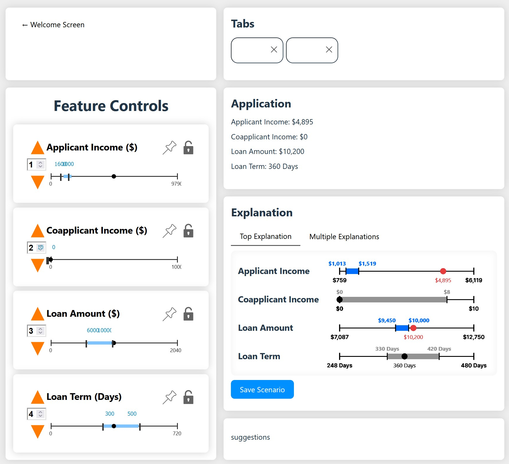

# FACET: Robust Counterfactual Explanation Analytics

This repository contains prototype code for the paper *FACET: Robust Counterfactual Explanation Analytics*, currently under review at VLDB 2023.

FACET (Fast Actionable Counterfactuals for Ensembles of Trees) generates a novel type of explanation which we call *counterfactual regions* for decisions made by ensembles of trees. For an instance `x` a counterfactual region `R` defines a portions of the feature space where all points `x' in R` are guaranteed to be counterfactual to `x`, e.g. if `y=f(x)=A` then `y=f(x')=B`. We design FACET to be highly performant and support a wide variety of user parameters such that explanations can be interactively personalized to meet real users needs.

## UI State

The current state of the UI is a shown. Revised 1/28/24, 5PM



## Requirements

The code in this repository was developed using Python 3.8.13, [requirements.txt](./requirements.txt) contains a list of required packages and is formatted for use with [Anaconda](https://www.anaconda.com/). To run experiments with OCEAN, a state-of-the-art method we compare to, you will need a license for the Gurobi optimizer. Free academic licenses are available [here](https://www.gurobi.com/academia/academic-program-and-licenses/). Setup can be done as follow

```bash
# create the anaconda environment
conda config --add channels https://conda.anaconda.org/gurobi
conda create --name facet --file requirements.txt
conda activate facet
# install solver needed for SOTA comparison method MACE
pysmt-install --z3 --confirm-agreement
# activate gurobi for SOTA comparison method OCEAN
grbgetkey <your_acadmic_license_key>
```

## Generating Explanation

For convenience [main.py](./main.py) takes a variety of command line arguments

| flag         | purpose                                              | allowed values                                                       |
| ------------ | ---------------------------------------------------- | -------------------------------------------------------------------- |
| --expr       | the experiment to run                                | simple, ntrees, nrects, compare, k, m, nconstraints, perturb, robust |
| --values     | the experimental values to test                      | space separated list of values e.g. `10 50 100` or `0.1 0.2 0.3`     |
| --ds         | the dataset to explain                               | cancer, glass, magic, spambase, vertebral                            |
| --method     | the XAI method to use                                | FACETIndex, OCEAN, RFOCSE, AFT, MACE                                 |
| --ntrees     | the ensemble size to test                            | integer value, overridden in for --expr ntrees                       |
| ----maxdepth | the max depth of ensemble trees                      | integer value, `-1` for no max depth                                 |
| --it         | the iteration to run, used as random seed            | space separated integer values                                       |
| --fmod       | a filename modifier append to append to results file | string value                                                         |

Executing `python main.py` with no flags will perform a simple explanation of 20 instances on the vertebral dataset using FACET and an ensemble with `T=10, Dmax=5`. Parameters not involved in any given experiment are set to the default values provided in [experiments.py](./experiments/experiments.py)

All results are output to `./results/<expr_name>.csv`. Generated explanations, all parameters used in each iteration, and a summary of results can be found at `./results/<expr_name>.csv`. Code for generating all figures from the paper are available in Jupyter Notebooks at `./figures/<expr_name>.ipynb` and should be pointed to a matching results csv file of your choice.

## Data Sources

All datasets are pulled as is from the [UCI Machine Learning Repository](https://archive.ics.uci.edu/ml/index.php) and are included in this repository.

| Dataset Name                                  | Abbreviated Name | # Points           | # Dimensions                | nClass                   | Source                                                                                  |
| --------------------------------------------- | ---------------- | ------------------ | --------------------------- | ------------------------ | --------------------------------------------------------------------------------------- |
| Breast Cancer Wisconsin (Diagnostic) Data Set | `cancer`         | 699                | 9                           | 2                        | [UCI](https://archive.ics.uci.edu/ml/datasets/Breast+Cancer+Wisconsin+%28Diagnostic%29) |
| Glass Identification Data Set                 | `glass`          | 214                | 9                           | 6 (2 float vs non-float) | [UCI](https://archive.ics.uci.edu/ml/datasets/Glass+Identification)                     |
| MAGIC Gamma Telescope Data Set                | `magic`          | 19020              | 10                          | 2                        | [UCI](https://archive.ics.uci.edu/ml/datasets/MAGIC+Gamma+Telescope)                    |
| Spambase                                      | `spambase`       | 4600               | 57                          | 2                        | [UCI](https://archive.ics.uci.edu/ml/datasets/Spambase)                                 |
| Vertebral Column Data Set                     | `vertebral`      | 310                | 6                           | 2                        | [UCI](https://archive.ics.uci.edu/ml/datasets/vertebral+column)                         |
| Loan Predication                              | `loans`          | 579 (dropping Nan) | 4 (dropping non-continuous) | 2                        | [Kaggle](https://www.kaggle.com/datasets/ninzaami/loan-predication)                     |

## Running the Visualization

To launch the explanation visualization tool do the following.

### Install Node

Our user interface is built using JavaScript and D3 across several files and uses Node Package Manager to install and build all dependencies. To access this [install Node.js](https://nodejs.org/en/download) for your platform and add it to your path. When using default settings on Windows Node will install to `C:\Program Files\nodejs`. Be sure to check `Automatically install the necessary tools` during installation. Node.js version 18.16.0 and npm version 9.5.1 were used for development.

### Build and Launch NPM

In the directory `./webapp` run `npm install` to install the required node packages. Then run `npm run dev` to launch the backend and front end 
