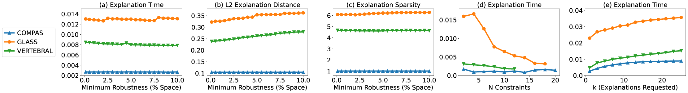
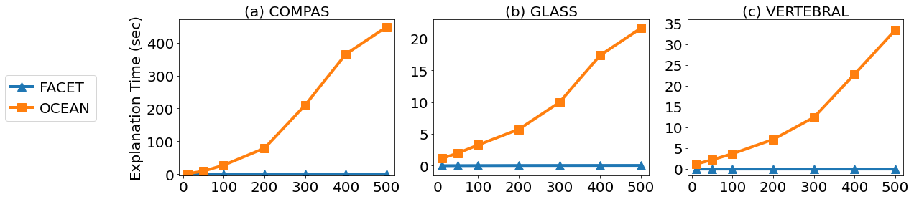
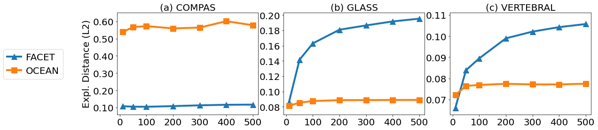

# Results on Additional Datasets

Our paper includes results for FACET on five publicly available benchmark datasets. We include results for three additional datasets here: COMPAS, GLASS, and VERTEBRAL. For a listing of each dataset. For a listing of information on all datasets see [Datasets](../README.md#datasets).

## Table 3 - Comparing Methods

Comparison to state-of-the art counterfactual example generation techniques (upper, 𝑇 = 10, 𝐷𝑚𝑎𝑥 = 100) and FACET
variations on Gradient Boosting (lower 𝑇 = 100, 𝐷𝑚𝑎𝑥 = 3) in terms time 𝑡, sparsity 𝑠, L1-Norm 𝛿1, L2-Norm 𝛿2, validity %.

## Figure 9 - Robustness to Perturbation

Evaluation of nearest explanation robustness to varying random perturbation size (percent of space)

## Figure 10 - User Query Workloads

Evaluation of FACET’s explanation analytics with diverse query workloads

## Figure 11 - FACET's COREX Index Evaluation

Evaluation of FACET’s explanation analytics using COREX, our counterfactual region explanation index

## Figure 12 - FACET's COREX Index Response Time

Evaluation of query response time with and without COREX, FACET’s bit-vector based counterfactual region
explanation index. Varying 𝑁𝑟 , the number of indexed counterfactual regions.

## Figure 13 - Model Scalability - Explanation Time

Explanation time as a function of model complexity. Varying number of trees 𝑇.

## Figure 14 - Model Scalability - Explanation Distance

Explanation distance as a function of model complexity. Varying number of trees 𝑇.

